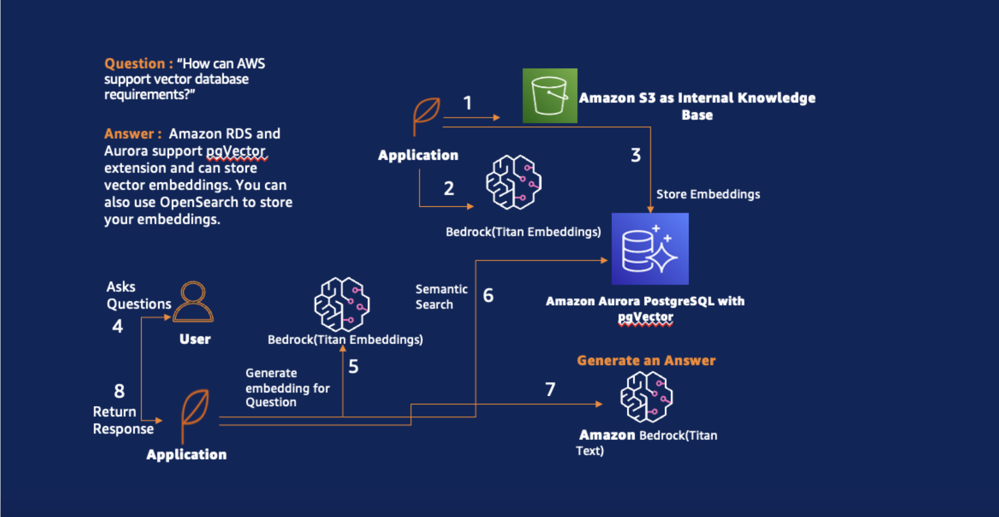
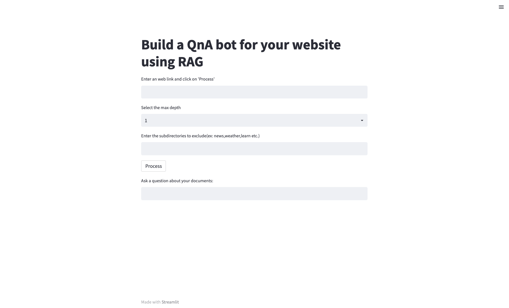

## Build a QnA bot for your website using RAG, Amazon Aurora PostgresSQL and Amazon Bedrock

### Use Case

In a digital age inundated with information, website visitors seek instant access to relevant content without the hassle of navigating through extensive web pages. A Q&A bot addresses this need by efficiently retrieving precise information based on natural language queries. This is particularly pertinent for websites with a wealth of data, FAQs, case studies, and other content, streamlining user interaction and information retrieval.

This code provides a solution for website owners seeking to enhance user engagement and streamline information retrieval by presenting a comprehensive guide on building a Natural Language Q&A Bot using Retrieval Augmented Generation (RAG) and Amazon Bedrock Models.

This approach leverages the power of langchain modules ([recursive_url](https://python.langchain.com/docs/integrations/document_loaders/recursive_url)) to recurisively get all the contents on a webpage based on the maximum depth we provide, convert the data into embeddings using Amazon Bedrock Titan Embeddings Model, store the embeddings in Aurora PostgresSQL using pgvector extension and retrieve the answer based on the question provided by the user using Amazon Bedrock 3P Models (Antropic Claude v2).

### Architecture

The architecture is as follows:



1. Companies possess a repository of knowledge resources in webpages like FAQ docs. These pages can have links to multiple webpages with more content. We can scrap the data using ([recursive_url](https://python.langchain.com/docs/integrations/document_loaders/recursive_url)) module in Langchain.  

2. Utilizing the Titan Embedding model from Amazon Bedrock, these resources are transformed into vector representations, ensuring their compatibility for advanced processing.

3. The generated vector embeddings are then stored within Amazon Aurora PostgreSQL, utilizing the specialized pgVector capabilities for efficient storage and retrieval.

4. A user initiates the process by posing a question, for instance, "How can AWS support vector databases?"

5. The user's question is seamlessly translated into its vector embedding, facilitating subsequent computational comparisons.

6. A semantic search operation is executed on the Amazon Aurora PostgreSQL database, employing the vectorized representations to identify knowledge resources with relevant
information.

7. The extracted answers from the search are fed into the Antropic Claude v2 model provided by Amazon Bedrock.

8. Leveraging the enhanced context and knowledge derived from the semantic search, the model generates a comprehensive response.

9. The generated response is subsequently delivered back to the user, providing them with a meaningful and informed answer to their initial question.

10. To retain context and support future interactions, the chat history is stored in Amazon DynamoDB, ensuring a seamless continuation of the conversation with the user.

### Execution

1. Make sure your Amazon Aurora PostgreSQL Database is setup with pgvector extension.

2. Make sure you have access to the Amazon Bedrock models you are trying to use.

3. The EC2 where you are runing the code needs access to the Amazon Aurora PostgreSQL Database, Amazon Bedrock Aws Secrets Manager via IAM Role

4. The code runs on Python3.10. Activate a virtual environment and install all the requirements
```
python3.10 -m venv venv
source venv/bin/activate
pip3 install -r requirements.txt
```

5. Modify the code variables Home.py with the appropriate details according to your environment: 
secret_name -> Secrete manager where for storing your Amazon Aurora PostgreSQL details
database -> the database name where embeddings will be created
model_id -> The Bedrock Model which you will be using

6. To run the Streamlit application
```
streamlit run Home.py
```

### Application


## Inputs: 
1. Web Link: Website you would like to scrape

2. Max Depth: Maximum recursive depths you would like to scrape

3. Exclude: subdirectories if any you would like to exclude

## Process Button:
1. To store the embeddings in Amazon AuroraPG

## Output:
1. Enter the Question to get the response

### Security

See [CONTRIBUTING](CONTRIBUTING.md#security-issue-notifications) for more information.

### License

This library is licensed under the MIT-0 License. See the LICENSE file.

